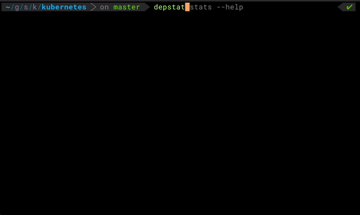

# depstat

`depstat` is a CLI for analyzing Go module dependency graphs, with a strong focus on Kubernetes dependency review workflows.



## Installation

```bash
go install github.com/kubernetes-sigs/depstat@latest
```

## Quick Start

```bash
cd <your-go-module>
depstat stats          # dependency counts and max depth
depstat list           # sorted list of all dependencies
depstat graph          # write graph.dot (render with: dot -Tsvg graph.dot -o graph.svg)
depstat cycles         # detect dependency cycles
depstat why <module>   # explain why a dependency is present
```

## Kubernetes-Focused Documentation

For real usage against `k8s.io/kubernetes` (including `MAIN_MODULES`, PR diff analysis, and archived dependency checks), see:

- [docs/cli-kubernetes.md](docs/cli-kubernetes.md)

This guide mirrors the patterns used in Kubernetes test-infra Prow jobs.

## Commands

Run `depstat help` for full command help.

- `depstat stats`: dependency counts and maximum depth (`--json`, `--csv`, `--verbose`, `--split-test-only`, `--mainModules`, `--dir`)
- `depstat list`: sorted list of all dependencies in the current module (`--split-test-only`)
- `depstat graph`: write `graph.dot` (`--dep`, `--show-edge-types`, `--mainModules`)
- `depstat cycles`: detect dependency cycles (`--json`, `--mainModules`)
- `depstat why <dependency>`: explain why a dependency is present (`--json`, `--dot`, `--svg`, `--mainModules`, `--dir`)
- `depstat diff <base-ref> [head-ref]`: compare dependency changes between git refs (`--json`, `--dot`, `--verbose`, `--split-test-only`, `--mainModules`, `--dir`)
- `depstat archived`: detect archived upstream GitHub repositories (`--json`, `--github-token-path`, `--dir`)
- `depstat completion [bash|zsh|fish|powershell]`

The `--mainModules` / `-m` flag accepts a comma-separated list of module names to treat as "main" modules. This is essential for multi-module repositories like Kubernetes, where both the root module and all staging modules should be treated as first-party code rather than external dependencies. Without `-m`, depstat auto-detects a single main module from `go list -m`.

Use `depstat stats --split-test-only` to separate totals into test-only and non-test dependency sections (classified via `go mod why -m`).

## Project Goals

`depstat` is developed under SIG Architecture code organization efforts to make dependency changes easier to evaluate in Kubernetes CI.

## Community Contact Information

- [#k8s-code-organization](https://kubernetes.slack.com/messages/k8s-code-organization) on [Kubernetes Slack](http://slack.k8s.io)

## Code of Conduct

Participation in the Kubernetes community is governed by the [Kubernetes Code of Conduct](code-of-conduct.md).
